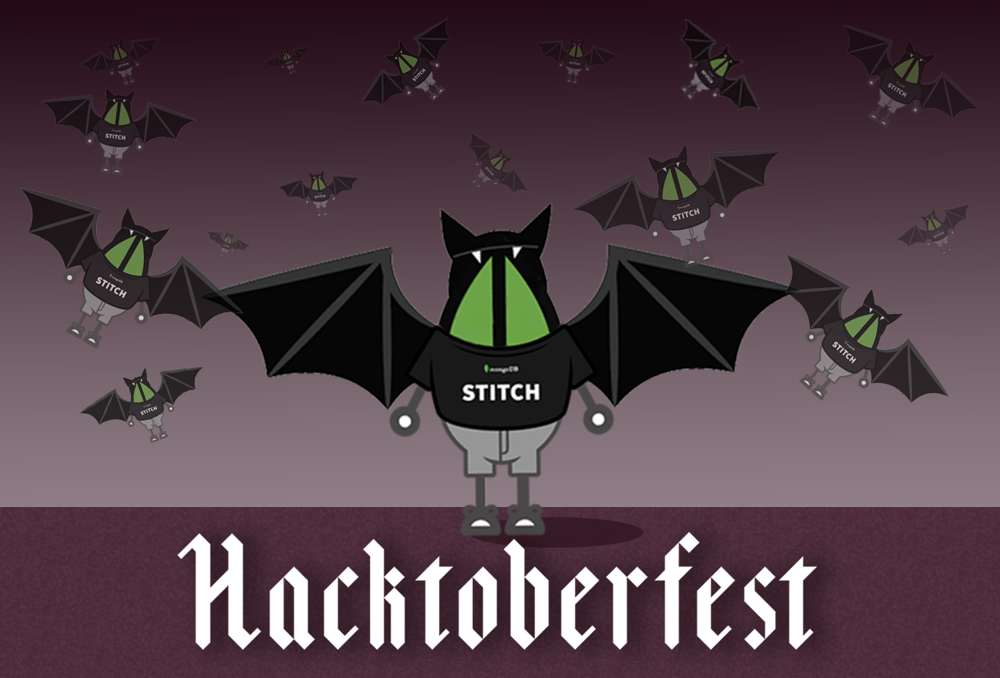

# Welcome to the MongoDB's Hacktoberfest Repository!

## What is Hacktoberfest?
Hacktoberfest is a month-long celebration of open source software. Started originally by our friends at [Digital Ocean](http://digitalocean.com)

## How is MongoDB Participating?
This year, we're celebrating open source software by hosting a challenge for software developers. Innovation and development of freely available software is an essential part of our ecosystem. This is why we're incenting developers to create interesting projects leveraging [MongoDB Stitch](http://www.mongodb.com/cloud/stitch) and export the apps for storage on a [GitHub](http://github.com) repository.

## How can you participate?
Simply create an app and leverage [MongoDB Stitch](http://www.mongodb.com/cloud/stitch) as part of the app. Export the source code for the app using the handy export capability from within Stitch. Then, create a README.md file for your project that leverages a [MongoDB Stitch App Badge](./badges.md). Similar to the following examples. See the Resources section of this file for more information on learning MongoDB Stitch.

## Include a badge on your Stitch App repository

### Working Stitch App Example
[](http://cloud.mongodb.com)

### Non-working Stitch App Example
[](http://cloud.mongodb.com)

Badges are created using a call to a MongoDB Stitch app that we wrote specifically for Hacktoberfest. You can see the source [here](https://github.com/mrlynn/hacktoberfest/blob/master/stitchapp/services/badgeservice/incoming_webhooks/badge/source.js).  To place a MongoDB Stitch app on your repository, simply create a Stitch App and visit the Getting Started page of your app to find the Stitch App ID. Create an image tag in the markup of your README replacing the <APPID> with your actual App ID:
  
  ```
  [](http://cloud.mongodb.com)
```
## Current Hacktoberfest Entries
> How do I get my project listed here?
> - Simply fork this repo, edit the table below to include your project details, then issue a pull request for changes to the README.md.
> - Please include Project name, author github user name (or link to pic), Repo Link, and a description of the project 

| Author | Repo | Description | Demo Link or other notes |
| --- | --- | --- | --- |
| [](http://twitter.com/merlynn) |  [hacktoberfest2018](http://github.com/mongodb/hacktoberfest2018)| MongoDB Hackathon Repository with a working Stitch app. This app is actually a service that will return the stitch badge that you see above.|  [Badge](http://badge.learnstitch.com) |

## Resources

